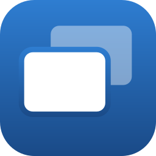
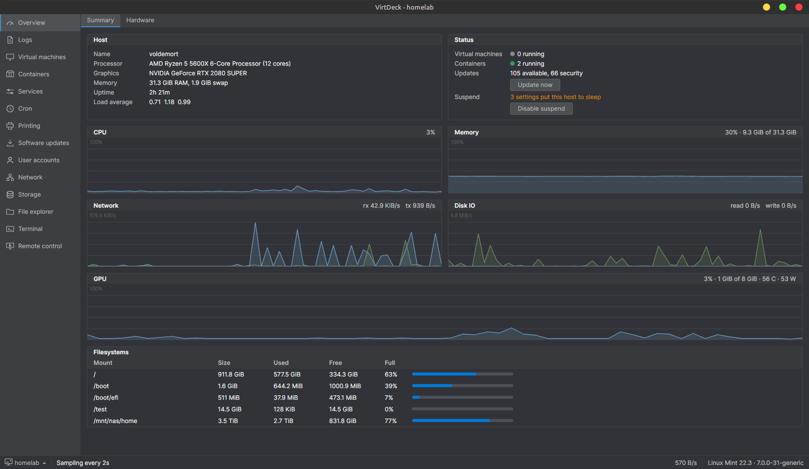

# VirtDeck

VirtDeck is a desktop app for managing a Linux server over SSH. Virtual machines, Docker
containers, services, storage, users, files and a terminal, all from one window and one SSH
connection. Nothing needs to be installed on the server.

It runs on **Windows and Linux**.



# Features

- **Virtual machines**: create, edit, start, stop and export libvirt/KVM VMs, with a built-in
  SPICE console (audio, clipboard, USB redirection, and ISOs streamed straight from your PC)
- **Unattended Windows installs**: build an answer file and attach it to a new VM
- **Containers**: Docker containers, images, volumes, networks and compose stacks
- **Host overview**: live CPU, memory, network, disk and GPU graphs, plus the hardware
- **Services, cron and logs**: systemd units, every crontab, and the journal
- **Storage**: disks, SMART, mounting, and ZFS pools and datasets
- **Network**: interfaces, bridges, bonds, VLANs and the firewall, with automatic rollback if a
  change cuts you off
- **Software updates**: apt, dnf and pacman
- **Users, Samba shares and printers**
- **File explorer and terminal**, with drag and drop between your PC and the server
- **Remote control**: the server's own desktop, inline

Pages only show up when the server has the tools for them, so a plain file server does not get a
Virtual machines tab.

# Installation

Download the latest release from the [Releases](https://github.com/LJFloor/VirtDeck/releases)
page:

- **Windows**: `VirtDeckSetup-*.exe`
- **Linux**: `VirtDeck-*-x86_64.AppImage`. For USB redirection, also install the udev rule from
  [`packaging/`](packaging/README.md).

The server only needs SSH with a sudo-capable account.

# FAQ

**Does it need an agent on the server?**

No. Everything goes through the tools the server already has (`virsh`, `docker`, `systemctl`, and
so on). The one exception is Remote control, which uploads a small helper the first time you
use it.

**Does it run on macOS?**

Not at the moment.

# Building

```bash
dotnet build VirtDeck.sln
dotnet run --project VirtDeck.Avalonia
```

Release artifacts are built with `packaging/build-appimage.sh` (Linux) and `publish.bat`
(Windows). See [docs/build-and-packaging.md](docs/build-and-packaging.md), and
[CLAUDE.md](CLAUDE.md) for the full documentation index.

# License

GPL-2.0-only with a linking exception. See [LICENSE.txt](LICENSE.txt).
